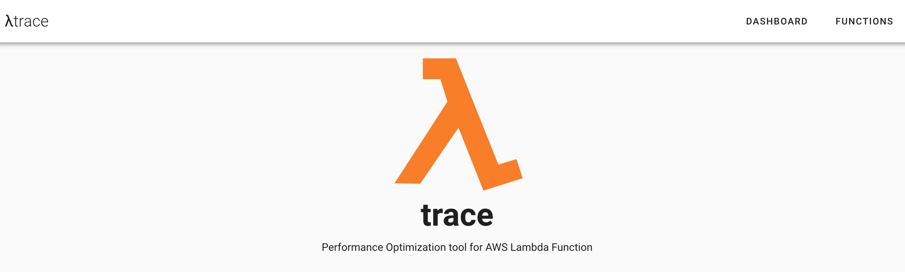
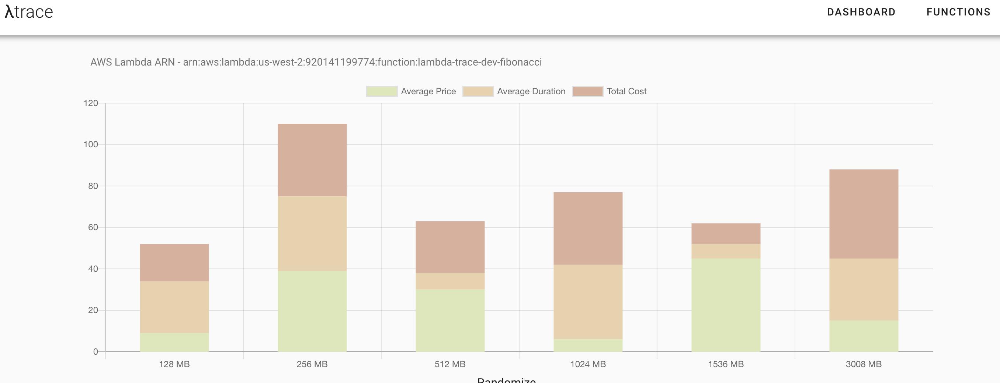
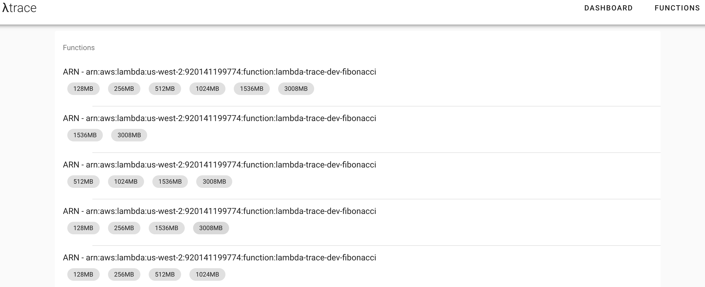
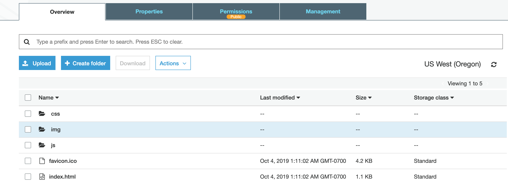

# λtrace - Performance Optimization tool for AWS Lambda Function

λtrace an service that helps you optimize your Lambda functions in a data-driven way. As a user you can provide any Lambda function as input and the service will create multiple verison of your lambda with different memeory configurations, analyze execution logs and suggest you the best configuration to minimize cost.

## Getting Started

- Download the AWS CLI `$ pip install awscli --upgrade --user`
- Verify that AWS CLI installed correctly `$ aws --version`
- Install serverless framework `$ npm install -g serverless`
- Enter IAM keys in the serverless configuration `$ serverless config credentials --provider aws --key xxxxxxxxxxxxxx --secret xxxxxxxxxxxxxx`

## Project structure

λtrace is devided into two projects. 

- `lamda-trace-platform` is the REST API backend that power the creation and gather information from lambda invocation logs.

- `lambda-trace-dashboard` is a single page webapp to visualize logs and metrics. 

```
├── README.md
├── lambda-trace-dashboard
│   ├── README.md
│   ├── babel.config.js
│   ├── dist
│   ├── jest.config.js
│   ├── node_modules
│   ├── package-lock.json
│   ├── package.json
│   ├── postcss.config.js
│   ├── public
│   ├── src
│   └── tests
└── lambda-trace-platform
    ├── cleaner
    ├── example
    ├── executer
    ├── finalizer
    ├── functions
    ├── initializer
    ├── lib
    ├── node_modules
    ├── package-lock.json
    ├── package.json
    ├── runs
    ├── schemas
    └── serverless.yml
```

## Installing

Clone the repo:

```
git clone git@github.com:Zahidul-Islam/InsightDataEngineering.git

cd InsightDataEngineering
```


## Deployment

### Deploy Serverless Functions

```
cd lambda-trace-platform
npm install
serverless deploy
```

```
Serverless: Packaging service...
Serverless: Excluding development dependencies...
Serverless: Excluding development dependencies...
Serverless: Excluding development dependencies...
Serverless: Excluding development dependencies...
Serverless: Excluding development dependencies...
Serverless: Excluding development dependencies...
Serverless: Excluding development dependencies...
....
....
Serverless: Stack update finished...
Service Information
service: lambda-trace-platform
stage: dev
region: us-west-2
stack: lambda-trace-platform-dev
resources: 43
api keys:
  None
endpoints:
  POST - https://xxxxxxxx.execute-api.us-west-2.amazonaws.com/dev/api/v1/initializer
  POST - https://xxxxxxxx.execute-api.us-west-2.amazonaws.com/dev/api/v1/executer
  POST - https://xxxxxxxx.execute-api.us-west-2.amazonaws.com/dev/api/v1/cleaner
  POST - https://xxxxxxxx.execute-api.us-west-2.amazonaws.com/dev/api/v1/functions
  GET - https://xxxxxxxx.execute-api.us-west-2.amazonaws.com/dev/api/v1/functions
  GET - https://xxxxxxxx.execute-api.us-west-2.amazonaws.com/dev/api/v1/functions/{id}
functions:
  initializer: lambda-trace-platform-dev-initializer
  executer: lambda-trace-platform-dev-executer
  cleaner: lambda-trace-platform-dev-cleaner
  functions-create: lambda-trace-platform-dev-functions-create
  functions-list: lambda-trace-platform-dev-functions-list
  functions-get: lambda-trace-platform-dev-functions-get
  fibonacci: lambda-trace-platform-dev-fibonacci
layers:
  None

Stack Outputs
FibonacciLambdaFunctionQualifiedArn: arn:aws:lambda:us-west-2:920141199774:function:lambda-trace-platform-dev-fibonacci:1
InitializerLambdaFunctionQualifiedArn: arn:aws:lambda:us-west-2:920141199774:function:lambda-trace-platform-dev-initializer:1
FunctionsDashlistLambdaFunctionQualifiedArn: arn:aws:lambda:us-west-2:920141199774:function:lambda-trace-platform-dev-functions-list:1
CleanerLambdaFunctionQualifiedArn: arn:aws:lambda:us-west-2:920141199774:function:lambda-trace-platform-dev-cleaner:1
ExecuterLambdaFunctionQualifiedArn: arn:aws:lambda:us-west-2:920141199774:function:lambda-trace-platform-dev-executer:1
FunctionsDashgetLambdaFunctionQualifiedArn: arn:aws:lambda:us-west-2:920141199774:function:lambda-trace-platform-dev-functions-get:1
FunctionsDashcreateLambdaFunctionQualifiedArn: arn:aws:lambda:us-west-2:920141199774:function:lambda-trace-platform-dev-functions-create:1
ServiceEndpoint: https://xxxxxxxx.execute-api.us-west-2.amazonaws.com/dev
ServerlessDeploymentBucketName: lambda-trace-platform-de-serverlessdeploymentbuck-eebu7h0uxwpg

Serverless: Run the "serverless" command to setup monitoring, troubleshooting and testing.
```

### Deploy Single page App

```
cd lambda-trace-dashboard
npm install
```

#### Run locally 
- Run `npm run dev` 
- Open your browser and navigate to `http://localhost:8080`. You should see the frontend come alive!

**Home Page**


**Dashboard**


**Functions**


#### Deploy to AWS S3

- Create a S3 bucket. Example: `lambda-trace-dashboard`
- Add bucket permission

```
{
    "Version": "2012-10-17",
    "Statement": [
        {
            "Sid": "PublicReadGetObject",
            "Effect": "Allow",
            "Principal": "*",
            "Action": "s3:GetObject",
            "Resource": "arn:aws:s3:::lambda-trace-dashboard/*"
        }
    ]
}
```
- Run `npm run build`. It will create all the files necessary to deploy `webapp` in `S3` into `dist` folder.

- Update files into `S3`
```
aws s3 sync ./dist s3://lambda-trace-dashboard
```
You should see all the files in `S3`

